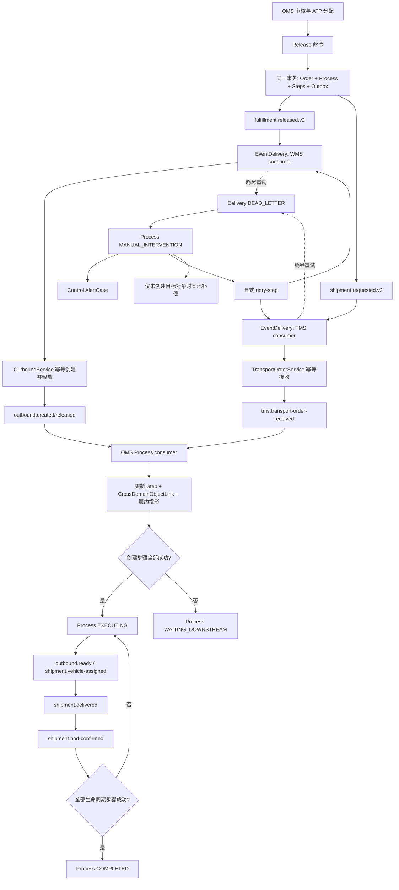
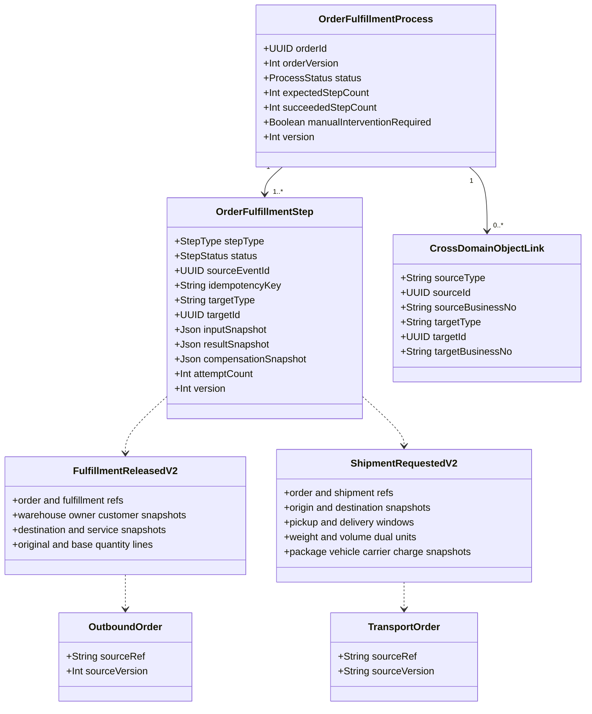

# SCM V2 OMS→WMS/TMS 履约运行闭环

本图集描述 V2-03 已落地的运行时边界。WMS/TMS consumer 只读取自包含事件，不查询 OMS 内部表；所有副作用均通过目标域公开服务完成。

## 自动履约流程



## 事件时序

```mermaid
sequenceDiagram
  participant O as OMS Release TX
  participant L as Delivery Ledger
  participant W as Worker
  participant WC as WMS Consumer Facade
  participant TC as TMS Consumer Facade
  participant PM as OMS Process Manager
  participant C as Control
  O->>O: create Process and command Steps
  O->>L: v2 events fan-out after commit
  W->>L: claim ordered deliveries
  W->>WC: fulfillment.released.v2 + eventId:consumer
  WC->>WC: Inbox dedupe, create/release Outbound
  WC-->>PM: outbound.created/released.v1
  W->>TC: shipment.requested.v2 + eventId:consumer
  TC->>TC: Inbox dedupe, receive TransportOrder
  TC-->>PM: tms.transport-order-received.v1
  PM->>PM: update Step, Link and Process
  PM->>PM: EXECUTING after downstream objects exist
  WC-->>PM: outbound.ready.v1
  TC-->>PM: vehicle-assigned / delivered / pod-confirmed
  PM->>PM: complete lifecycle Steps; then COMPLETED
  alt delivery retries exhausted
    L-->>PM: control.event-delivery-dead-lettered.v1
    PM->>PM: MANUAL_INTERVENTION
    PM-->>C: oms.fulfillment-process-failed.v1
    C->>C: create deduplicated AlertCase
  else operator retries failed step
    PM->>L: reissue original v2 command event
  end
```

## 核心类图


