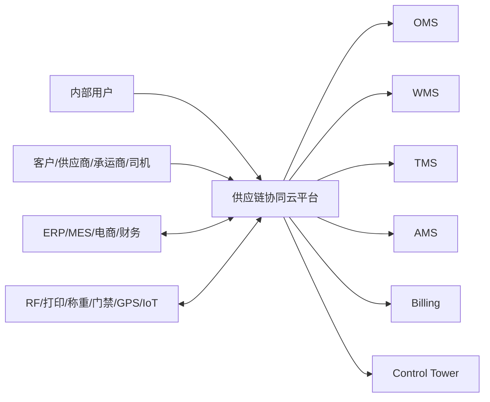
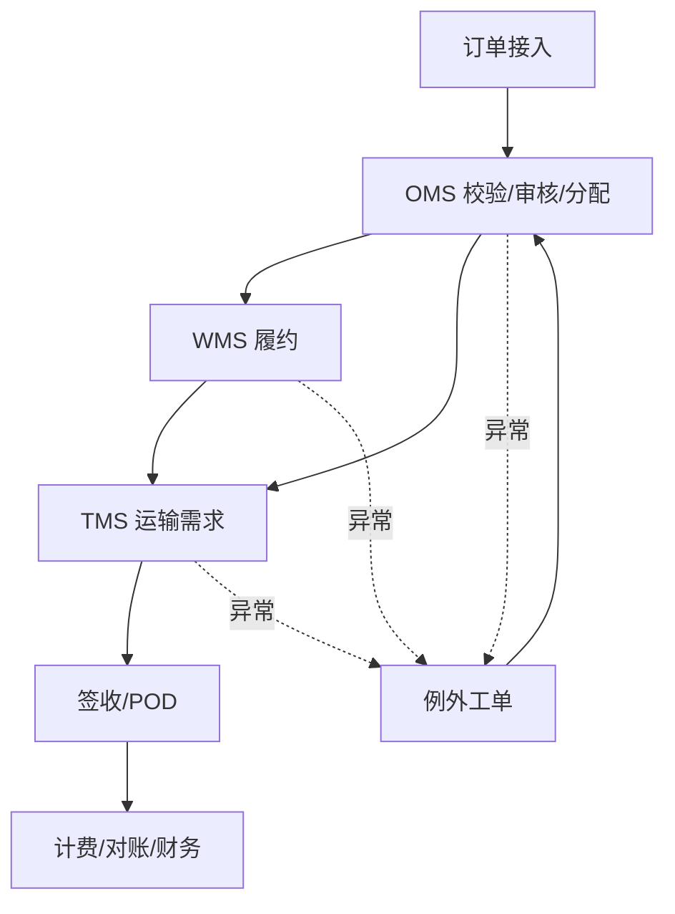
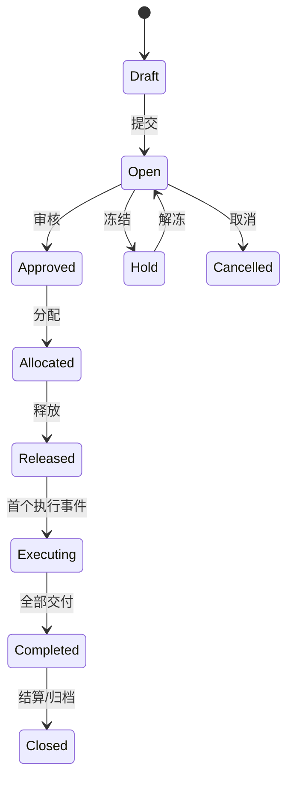
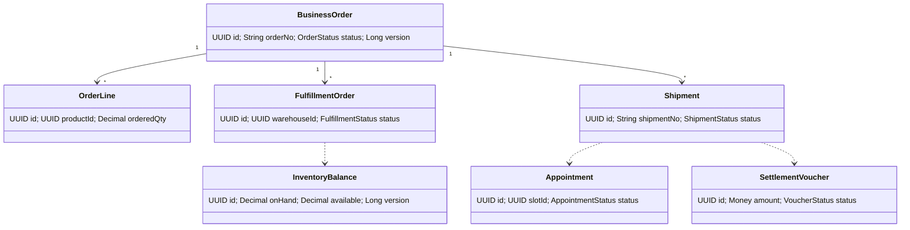
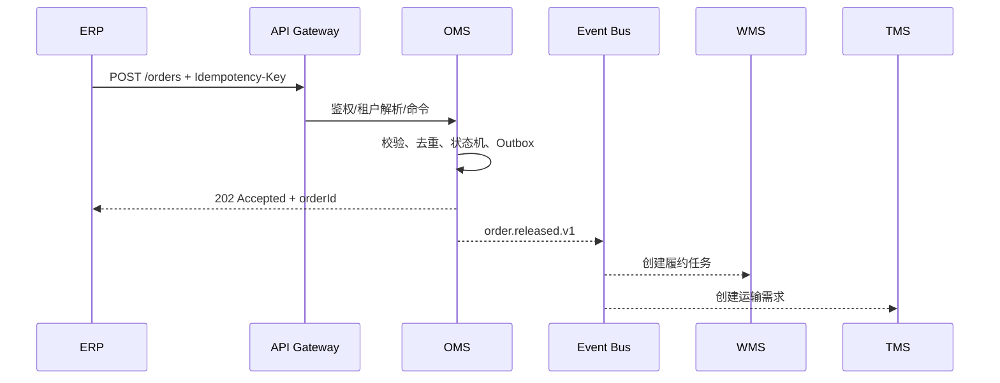

# SCM 同类系统 - Mermaid 可编辑模型（v0.1）

> 这些图是 clean-room 建议模型，非目标站点原始代码或数据库。

## 1. 系统上下文

```mermaid
flowchart LR
  I[内部用户] --> P[供应链协同云平台]
  X[客户/供应商/承运商/司机] --> P
  E[ERP/MES/电商/财务] <--> P
  D[RF/打印/称重/门禁/GPS/IoT] <--> P
  P --> O[OMS]
  P --> W[WMS]
  P --> T[TMS]
  P --> A[AMS]
  P --> B[Billing]
  P --> C[Control Tower]
```

## 2. 端到端流程

```mermaid
flowchart TD
  A[订单接入] --> B[OMS 校验/审核/分配]
  B --> C[WMS 履约]
  B --> D[TMS 运输需求]
  C --> D
  D --> E[签收/POD]
  E --> F[计费/对账/财务]
  B -.异常.-> X[例外工单]
  C -.异常.-> X
  D -.异常.-> X
  X --> B
```

## 3. 订单状态机

```mermaid
stateDiagram-v2
  [*] --> Draft
  Draft --> Open: 提交
  Open --> Approved: 审核
  Approved --> Allocated: 分配
  Allocated --> Released: 释放
  Released --> Executing: 首个执行事件
  Executing --> Completed: 全部交付
  Completed --> Closed: 结算/归档
  Open --> Hold: 冻结
  Hold --> Open: 解冻
  Open --> Cancelled: 取消
```

## 4. 核心类图

```mermaid
classDiagram
  class BusinessOrder { UUID id; String orderNo; OrderStatus status; Long version }
  class OrderLine { UUID id; UUID productId; Decimal orderedQty }
  class FulfillmentOrder { UUID id; UUID warehouseId; FulfillmentStatus status }
  class InventoryBalance { UUID id; Decimal onHand; Decimal available; Long version }
  class Shipment { UUID id; String shipmentNo; ShipmentStatus status }
  class Appointment { UUID id; UUID slotId; AppointmentStatus status }
  class SettlementVoucher { UUID id; Money amount; VoucherStatus status }
  BusinessOrder "1" --> "*" OrderLine
  BusinessOrder "1" --> "*" FulfillmentOrder
  FulfillmentOrder ..> InventoryBalance
  BusinessOrder "1" --> "*" Shipment
  Shipment ..> Appointment
  Shipment ..> SettlementVoucher
```

## 5. 订单接入时序

```mermaid
sequenceDiagram
  participant ERP
  participant GW as API Gateway
  participant OMS
  participant BUS as Event Bus
  participant WMS
  participant TMS
  ERP->>GW: POST /orders + Idempotency-Key
  GW->>OMS: 鉴权/租户解析/命令
  OMS->>OMS: 校验、去重、状态机、Outbox
  OMS-->>ERP: 202 Accepted + orderId
  OMS-->>BUS: order.released.v1
  BUS-->>WMS: 创建履约任务
  BUS-->>TMS: 创建运输需求
```
