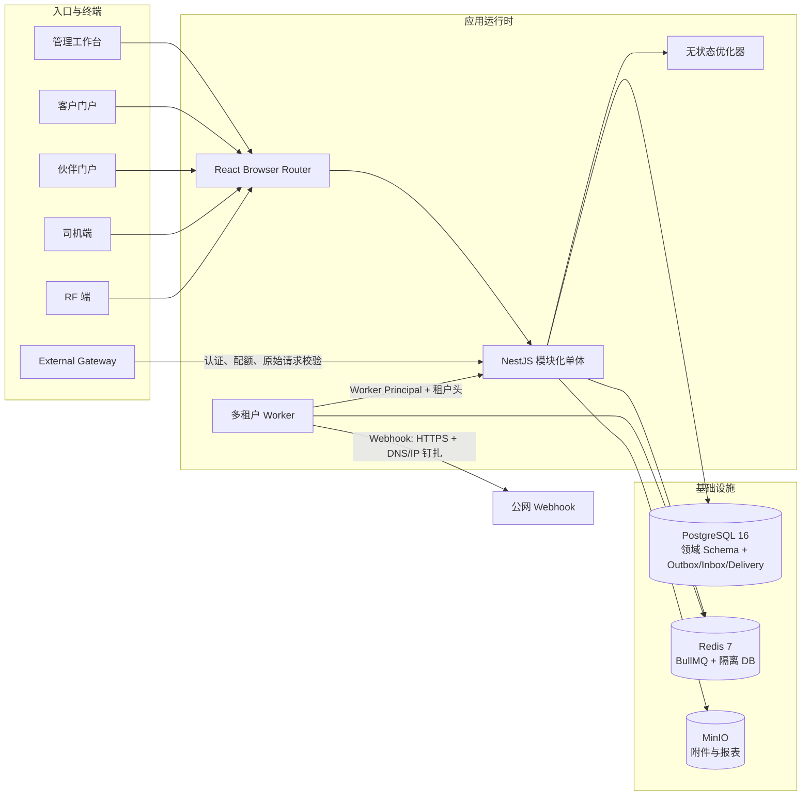
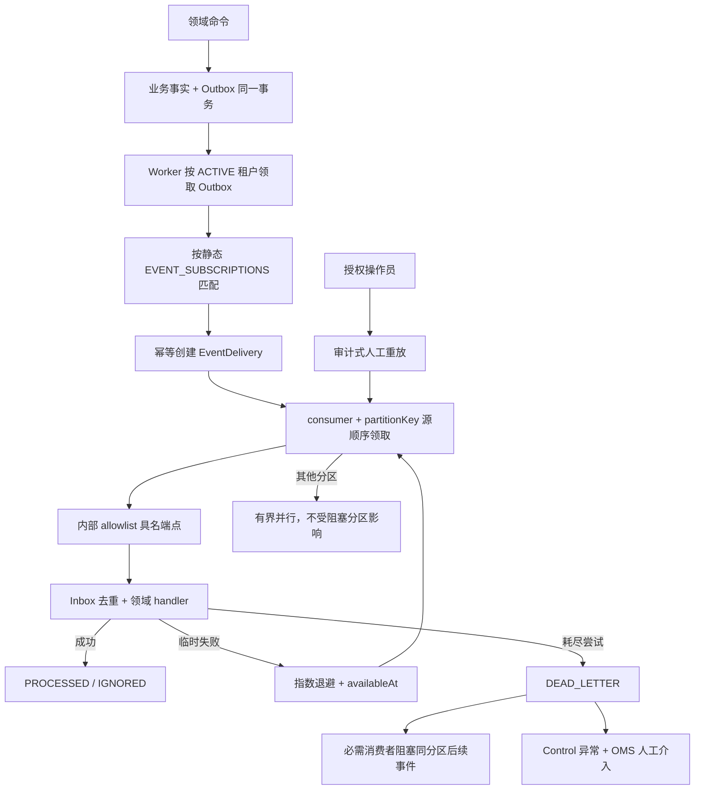
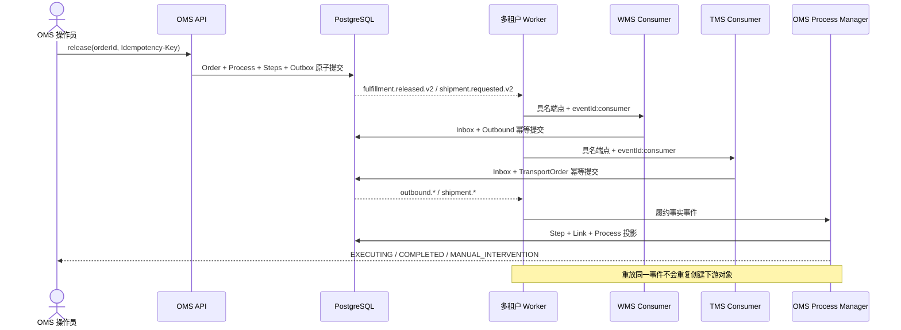
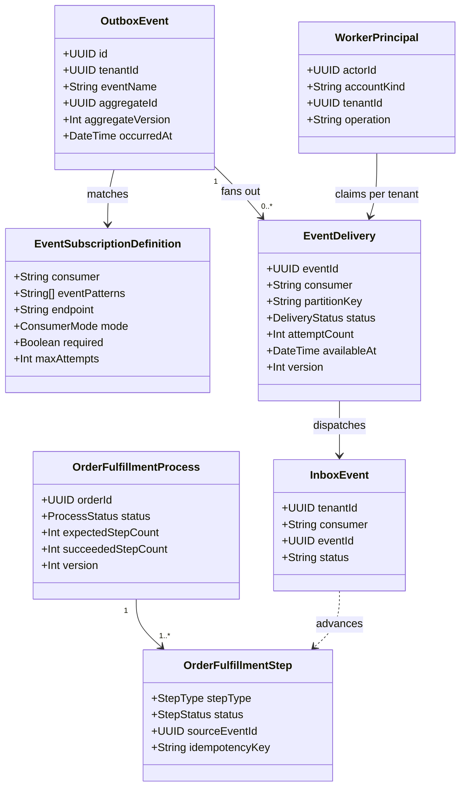

# SCM V2 运行闭环架构

本文描述 V2-01 至 V2-08 已实现的运行时结构。代码清单是事件和订阅的事实来源，生成结果见 [V2 事件目录](V2_EVENT_CATALOG.md)；本文件不替代领域边界、状态机和数据不变量。

## 逻辑架构

## 事件投递流程

## OMS 自动履约时序

## 核心运行时类图

## 运行边界

- 跨域只交换自包含事件合同、业务号、对方 ID 和必要快照；不跨域 JOIN、外键或导入内部仓储。
- `EVERY_EVENT` 逐 `eventId` 处理；只有声明为 `LATEST_STATE` 的最终状态投影可以留下可观测的旧版本 `IGNORED`。
- Worker 使用专用 control token 和 actor，每次后台请求显式携带租户；服务端对 operation deny-by-default。
- 外部 Gateway 的 method、path、IP、body bytes/hash 均取自真实请求；Webhook 在配置和每次投递时都重新验证 DNS/IP。
- 管理端和四类终端均由 Browser Router 注册，支持刷新、历史和地址栏深链。
